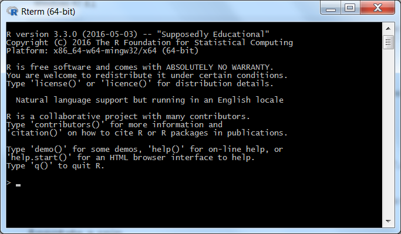
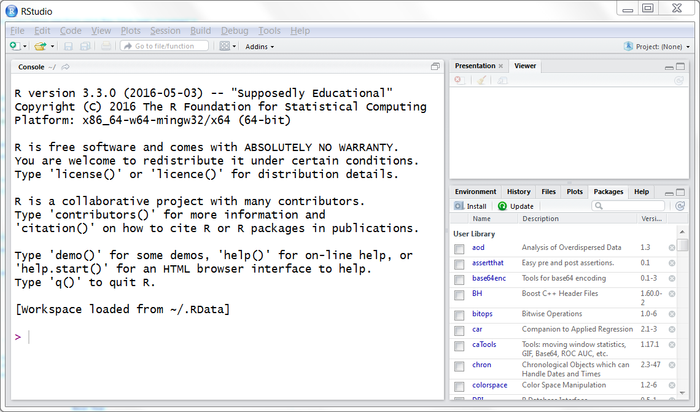
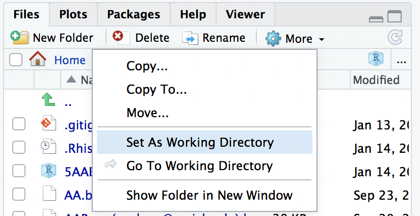

---
output:
  pdf_document: default
  html_document: default
---

# Our Tools: R, RStudio

R is awesome. R is also considered pretty difficult to learn. In my opinion, that's not true. In this chapter, we will quickly get out feet wet in the shallow end of the R pool - ready to jump off the deep end in the succeeding chapters.

## Introduction to R and RStudio

For the purpose of this course, R is a Statistical Computing Environment. It provides us with an underlying computer language, analysis tools and software platform for us to work with data. While R is pretty powerful, it is built by geeks for geeks. As a result, it lacks the user-friendliness needed by beginners and casual users. To help mitigate this problem, we do not directly interface with R and instead use the user friendly RStudio software as a wrapper around R. RStudio is often considered an IDE (Integrated Development Environment) for R.

For the record, R is a pretty awful name for anything - try googling "R" and see how relevant the search results are! It is called R after the first name of the two authors of R: Robert and Ross. The name kinda makes sense when you consider that R is based on another programming language named S.

### Download and Install R and RStudio

R can be downloaded from any of the mirror sites maintained by the Comprehensive R Archive Network ("CRAN"). I recommend the CRAN Mirror maintained by RStudio: https://cran.rstudio.com/. Here you will find links to download R for Windows, Mac-OS and Linux. The current version of R available for Windows is R `r paste(version$major, version$minor, sep = ".")` and measures at around 70MB. Follow the directions to install the starting packages for R - often called "Base R".

Even though we will not use a bare R installtion - lets take a look at it anyway. Launch R once the installation finishes. It will look similar to the figure below. This window is called the R Console. As you would note - it looks a little scary - no icons, nothing clickable, no menu even. While it is possible for us to do everything we wish to do with R just with the R Console, it really would be nice to make our experience with R a little more user friendly. Lucky for us, we have RStudio to pick up the slack here.




Once you have finished installing R, you can download and install RStudio from: https://www.rstudio.com/products/rstudio/download/. There again are installers available for Windows, Mac-OS and Linux. After you are done installing RStudio, you should launch RStudio to check that everything is installed and connected properly. When you launch RStudio for the first time, you will see something similar to the figure below.



The larger part of the RStudio window is same as the R Console and this is in-fact R running inside RStudio. When we launched R independently, this is the prompt that you we got. RStudio combines this direct access to R with other useful elements. In the bottom right, you have access to the file system, you can manage R packages (more about them later), read Help documentation and see various plots and charts that you will soon be building. In the top right, RStudio provides you with details of current R environment and a history of your recent R commands. If you are using Git repository for your files then you will see Git tab here.

Now that we have both R and RStudio set up, it is time for us to get started in making some use of it. Note that the R environment is used primarily by typing commands on the Console prompt or running commands saved in a file - typically a R Script file or a RMarkdown file. While RStudio provides GUI elements for many common tasks, we will emphasize corresponding command line versions which usually provide better control and flexibility compared to their GUI counterparts. 

## Useful Features of RStudio

### Console

The console is where you can interact directly with the R system. You can write one line at a time and immediately execute it there by pressing enter. If you wish to write more than one command in one line then you can separate the commands using the semi-colon character. The console is essentially an R session running inside RStudio. The console shows a command prompt (usually the `>`}) character to indicate that you can type there. You can change the prompt by changing the options setting.^[I once thought it was very clever to have this as my prompt "Sanjeev Says: ". I no longer think so.]

### Editor

The editor is where you can work on and edit all of your files. This is a pure text editor - so no formatting of any kind. You will mostly be working with RMD files here. The tab panel at the top of the editor allows you to work on multiple files at once. The editor window is hidden when you start RStudio as you usually don't have a file to edit when you begin. Once you create/open a new file then they will open in the editor window and you can edit them. The editor window helpfully shows you the line numbers in left column and the cursor positioning in the line at the bottom left corner. The bottom right corner shows you the file type that you are working on. There are usual icons for saving a file, finding, spell check etc on the top bar. See Figure: \ref{fig:editor} for an example.


### Environment

The Environment tab shows you all of the variables currently stored in memory and what their values are.We haven't said what variables are as yet. Hold on - its coming in the next chapter. The tab in fact shows all the objects that currently exist in your R session. Objects will be discussed very soon, later in this chapter. Environment tab is a very useful place to have a quick look at the state of your current R session. The environment tab has a handy broom icon for deleting all the objects that exist and clearning your environment. You can, of course, do that using a command as well - **`rm`** for remove or delete. The command **`ls`** generates a list of all the objects in the environment. We can combine the two to delete every object in the environment if we so choose:

```{r, eval=FALSE}
rm(list = ls()) #Delete every object in the environment
```

### History

The History tab shows you the history of all the commands you have entered in the Console window. You can use available icons on top to search through the history or delete items from the history. Two very useful icons are for transferring commands to the console and to the source. See details in figure below. . The `To Console` option allows you to select one or more commands from the history and transfers them to the Console window where you can run them by pressing Enter. The `To Source` option sends the selected commands to the Editor window, to the currently open and active file.

```{r, fig.cap="RStudio History Window", out.width='50%', fig.align='center', echo=FALSE}
knitr::include_graphics("images/history.png")
```

### Files

The Files tab allows you to navigate through your filesystem, making it easy to load files into Rstudio. It shows the content of the current working directory when RStudio starts. You can navigate through the file system of your machine using the available options. The top icons provide ability to create a new folder, delete selected files, rename selected files and refresh file listings. The `More` option reveals further functionalities including two useful ones: the ability to set the currently displayed directory as the working directory and the ability to get the Files tab to display the contents of the current working directory. Figure:  shows the options.

```{r, fig.cap="RStudio Files Tab", out.width='50%', fig.align='center', echo=FALSE}

```

### Plots

the Plots tab shows the plots generated by the commands typed in the Console. See figure show the plot generated by the `plot(cars)` command in the Plots tab. As you can see, you can use options to zoom in/out and export the plot image as an image file or a PDF document. Plots made by R plots are Vector graphics and hence should be saved in vector formats like PNG and not bitmap formats like JPG.

```{r, fig.cap="Plots Window with a Demo Plot", out.width='50%', fig.align='center', echo=FALSE}
knitr::include_graphics("images/plots.png")
```

### Packages

The Packages tab shows you a list of all the packages installed on your system and their version number. You can check the checkbox next to the package name to manually load packages during your R session. You will also find icons for installing and updating packages. A search icon allows for searching among installed packages. 

### Help

As the name suggests, the Help tab can be used to find Help documentation on specific keywords. You can search for a keyword in the search field for looking at corresponding help documentation. If you write a help command in the console, then the output of that will also show in the Help tab. For example, if you type the command below (looking for help on "help"), you will get the help documentation as shown in figure below.

```{r, eval=FALSE}
help("help")
```
```{r, fig.cap="Helo Window on 'Help'", out.width='80%', fig.align='center', echo=FALSE}
knitr::include_graphics("images/help.png")
```

## Helpful Menu Items and Keyboard Shortcuts

## Essential R Tips and Tricks

### R is Case Specific and Space Neutral

Everything in R is case specific. In R, upper case letters are considered completely different than their lower case counterparts. R will show no mercy if you mistype something in a difference case. However, R is pretty flexible about spaces and will usually accept multiple (or none) spaces where the default expectation is one space. 

### Comments and Line Continuation

You can add your comments/remarks in your R code by inserting the `#` character. Any text after the `#` character will be ignored by R during execution. It is essential that sufficient comments are added to your R code so that the code remains understandable and if you share your code with somebody else then they have a way of figuring out what you are trying to do, why and how.

R is smart enough to figure when the command is not finished and allows you to continue typing on the next line. This usually works well when there are un-finished parentheses or operators at the end. R indicates that it is expecting further inputs by showing the character `+` at the beginning of the next line. See figure for an example.

```{r, fig.cap="Line Continuation for Incomplete Commands", out.width='50%', fig.align='center', echo=FALSE}
knitr::include_graphics("images/incomplete.png")
```

### Naming Conventions

Object names in R can consist of any combination of alphanumeric characters (`a-z`, `A-Z`}, `0-9`) as well as underscore `-` and `.` characters. Object names should not include special characters such as `?` or space. Object names must start with a letter or a period. Special care should be taken to not include one of the reserved keywords (like `function` or `help`) as object names.


## RMarkdown (RMD) Files

We will use extensive ise of RMarkdown files in the class. Markdown is a simple formatting syntax for authoring documents. RMarkdown allows you to create Markdown documents with embedded R code in them. RMarkdown documents can then be rendered in variety of output formats such as HTML, PDF, and MS Word documents. 

RStudio streamlines the process of creating an RMarkdown file. Getting started is easy - in RStudio, go File -> New File -> R Markdown (or Alt-F-F-M). This will start a new RMD file for you. It needs some startup information to proceed first, as shown in the image below:

```{r, fig.cap="Figure: RMD Startup Dialog", out.width='50%', fig.align='center', echo=FALSE}
#knitr::include_graphics("images/RMDStart.png")
```

Title and Author are self explanatory. As the dialog suggests, you can choose HTML, PDF of Word as default output formats. PDF and Word require you to have a local installed version of TeX or MS-Word. For our class, I recommend that you use HTML as the default output - it is device and platform independent - and capable of handling variety of rich media. We will see later how to include dynamic content like animation and user interaction in these HTML files as well.

Once you say OK, you will be taken to the default start page. This page has some content already to help you started. You should be able to see the preamble right on top that will generate your document headers and also control various options:

```
title: "Untitled"
author: "Dr. Sanjeev Kumar"
date: "May 5, 2018"
output: html_document
```

You can make changes by either hand-editng the information above or by clicking the Edit Option icon (which looks like a gear) and choosign your options. For example, the preamble for one of my document looks like the following:


```
title: "How To Write RMarkdown Files"
author: "Dr. Sanjeev Kumar"
date: "May 5, 2016"
output:
  html_document: 
    highlight: tango
    number_sections: yes
```

Now you can go ahead and add content to your document. When you want to create the output,  click the `Knit` button and a document will be generated that includes both content as well as the output of any embedded R code chunks within the document. We will see later in the document how to embed R code in RMD files.

It is easy to format RMarkdown files and embed R code in them. For more details on using R Markdown see http://rmarkdown.rstudio.com.

## Embedding R Code Blocks in RMD Files

### Embedding Options

- echo
- eval
- cache
- label
- fig.height/width

### Embedding Code Blocks of Other Languages


### Embedding in-line R Code


### Reproducibility of Data Analysis

A key advantage of using an RMD file is that the output contains both the R code and the output. That allows for a precise matching of what steps were performed to reach a specific output. Consider the example of a complex chart made in MS-Excel - you would be hard pressed to figure out what exactly was done to create that chart. Whether the chart has some data manipulation in it, whether the chart inadvertently includes a mistake - there is no transparency - and hence you are likely to not have much trust in the chart. In the case of RMD files on the other hand, the entire process of creating the chart is right there in the form of R commands. Anybody else with the same data and the same commands will reach exactly the same output. Your analysis can be reproduced by anybody else - imporving the reliability and trustworthiness of your analysis.

We discussed "veracity" as one of the four Vs of Big Data. Doing data analytics in a way that is reproducible (e.g through an RMD file) goes a long way towards establishing confidence in the results of the analysis.

## Key Features of R/RStudio Ecosystem

### Open Source Software

Open Source Software is a broad term for software that is developed by a community of volunteers and is available free of charge for you and I to use. R is open source with a strong and dedicated community that takes the stewardship of R very very seriously. 

As R is open source, the underlying computer code (the source code) is available for anyone to view and modify. All these extra eyes looking at the code usually means a more reliable, error free and malware resistant software. 

Open source nature of R has both positive and negative impacts. On the positive side, the community helps extend R rapidly by building new packages with new capabilities very quickly. On the negative side, the R platform is built by experts for experts - the focus is on capability and precision - not on ease of use. This makes R a swiss army knife of that is capable of doing almost everything possible in data domain but a knife that can be difficult to learn how to use.

### Extensability of R

R is desiged to be easily extended. You, me and everyone else can write new functionalities for R and have it available for everyone in the world to download and use. The R community has been writing extensions for decades now and the result is a library of thousands of packages. If there is anything data analysis related that you want to do, chances are that somebody else wanted to do it too, has already built a package for it that you can download and use. 

Easy extensability of R is one of the main reasons why R remained the most capable, cutting edge data analytical platform for decades now. R community has written packages to allow you write SQL commands, C++ commands, build geo-maps, build predictive models - all within the R platform. New developments tend to get incorporated in R much faster than in competing statistical software such as Stata, SAS or SPSS.     

### Usability of R

R is not graphical. Much of R's capabilities are accessed through typing R commands rather than clicking buttons or accessing menus. R commands allow a level of precision and flexibility that is typically now achievable through a graphical interface. Doing complex tasks successfully in R involves writing a sequence of R commands that are closer to coding in a programming language than using a point and click software.

While R can be considered to have a steep learning curve, it should be noted that once you get through the learning curve and get used to R's syntax, you can slice through complex data analysis with much greater speed and capability than competing alternatives. In my opinion, the learning curves for R and competing graphical alternatives look like the figure below. R starts slower and has a difficult jumpstart but if you stay with it for a little bit then R handily outperforms the graphical alternatives.

```{r, fig.cap="Learning Curves for R (red) and alternatives (blue)"}
curve(x^2,from = 0,to = 3, xlab = "Time", ylab="Expertise", 
      col = "red", lwd=2, xaxt = 'n', yaxt = 'n')
abline(a = 2,b = 1, col = "blue", lwd = 2)
```

### R is NOT Verbose

In fact R is very very concise. It will not give you an output until you ask for it. This is very different than most statistical software that tend to overwhelm the user with every possible output possible. R allows you the flexibility to specifically request the levek of detail you need. By default, R will provide only the minimal amount of output.

### Object Oriented Programming

### R Community's Sense of Humor

R community is a hard working one - they are continuously building new and latest packages - making the R ecosystem even better. R community is also a fun one - a clever one at the very least. For example - look at the nickname for the current version:

```{r}
version$nickname
```

The R community is very helpful and will answer your questions if you post on relevant forums like StackExchange.com. However, they don't suffer fools and xpect people who ask questions to have done their homework. Over the years, the R community has developed an extensive knowledgebase that is only a google search away for you. As you go further in your exploration of R, attempt to learn from the community and hopefully one day be a bonafide member of the community.

## Common Issues, Pitfalls, Bugs, Obstacles and Their Solutions

This section is my master list of common issues that students encounter when they start working with R. You may want to not read this in full right now - treat this as a reference section. When you run into an issue, come by here and see if I have a solution for you.

### I have an older R installtion. How do I upgrade it?

You might have an old, not updated version of R in your machine. You can check the current version of your R by running the `version` command. If you have an older version and if you are in a Windows machine, then upgrading your R installation is easy with the `installr` package. The `installr` package has the handy `updateR` command that will automatically update your R installation to the latest one. A sample code to accomplish this is below:

```{r, eval=FALSE}
#Sample code, not being evaluated here
install.packages("installr") # install the installr package 
library(installr)
updateR() # updating your R version
version # command for checking your current R version
```


If you happen to be in a Mac or Linux machine, then you would want to download the current version of R and install. This process is similar to installing a fresh new installation of R as discussion in a previous section.

### Help - I am not being able to install any packages!

If you are unable to install R packages, there are a few things we can try.^[I am not going to insult your intelligence by asking you to make sure that you have a live Internet connection!] First thing to check would be your anti-virus software. Several anti-virus software balk at allowing R to perform tasks that may be interpreted as a security risk (for example - downloading and installing packages from the Internet). You can try to work around this by disabling/uninstalling your anti-virus or adding R to the exceptions list in the anti-virus.

You may also want to check whether you have administrator access in the machine you are working on. Several essential tasks in R require the user to have administrator access.

Lastly, R may be attempting to install packages into a directory that it does not have write permissions on. This can sometimes happen if you are on a computer on a network with mapped drives. You can work around this problem by asking R to install your packages in a safe, editable directory where you have write access. R installs all packages in a library directory - you can find out the current location of the library directory with the `.libPaths` command. You can use the `.libPaths` command to then add a directory location as your personal library location so that R can then install packages in that directory. A sample code to accomplish this is shown below: ^[Last command commented as C:/Whatever does not exist obviously - so would have resulted in an error - hence it is commented out.]

```{r}
.libPaths() #Shows the current library path
# You can add your own library folder to the path
#libPaths( c( .libPaths(), "C:/Whatever/Whatever...") )
```


### Why is the edit command not working for me?

One of the first R commands that gives trouble is the `edit` command. As the name suggests, `edit` is used for editing data - typically it shows the data to be edited in a table format with editable cells. This specific command (and its cousin, the `fix` command) seems to be very sensitive to the keyboard layouts, especially on Apple machines. This problem is hardware oriented and may prove difficult to solve. I usually recommend to ignore these two commands and take care of your data editing needs using alternative methods. If you were using `edit` for only viewing the data, then `View` is a good alternative for that.
